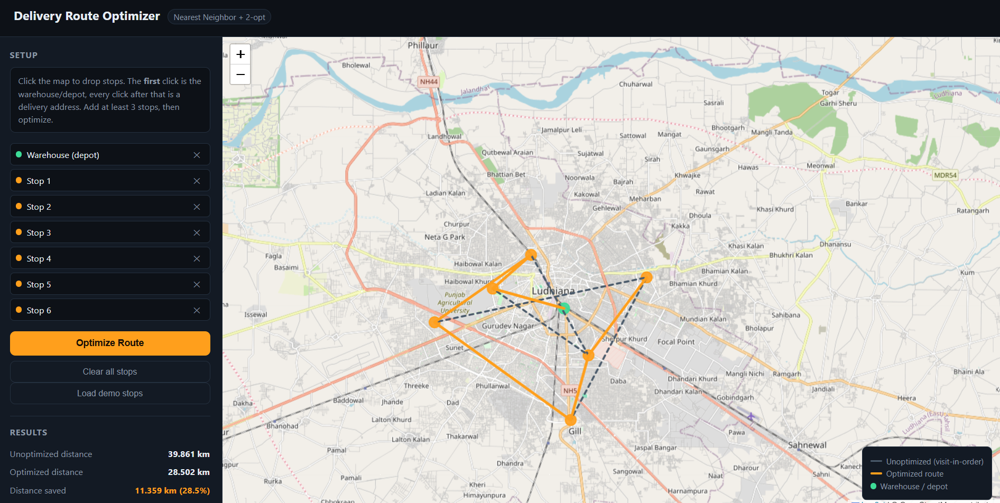

# Delivery Route Optimizer

A small logistics-optimization tool that finds the shortest delivery route
for a set of stops, inspired by the routing/logistics problem statements
from the **Amazon HackOn** hackathon track.

Given a warehouse (depot) and a list of delivery addresses, the app computes
an optimized visiting order using two classic routing algorithms and
visualizes the "before vs. after" route on an interactive map — showing the
distance and percentage saved.

## Live demo (screenshots)

Add your own screenshots to `screenshots/` once you run it locally, e.g.
`screenshots/demo.png`, and reference them here:

```markdown

```

## How it works

1. **Distance matrix** — pairwise distances between all stops are computed
   with the haversine formula (no paid map/routing API required).
2. **Nearest Neighbor heuristic** — builds an initial route by always
   moving to the closest unvisited stop.
3. **2-opt local search** — repeatedly reverses segments of the route to
   remove crossing paths, improving the Nearest Neighbor route further.
4. **Result** — the app reports total distance for the naive (visit-in-order)
   route vs. the optimized route, and the % distance saved.

This is a simplified, self-contained version of the Traveling Salesman
Problem (TSP), which is the core algorithmic challenge behind real-world
last-mile delivery routing (Amazon, Flipkart, Swiggy/Zomato delivery apps,
etc.).

## Tech stack

- **Backend:** Python, Flask, REST API
- **Algorithms:** Haversine distance, Nearest Neighbor heuristic, 2-opt
  optimization
- **Frontend:** HTML/CSS/JS, [Leaflet.js](https://leafletjs.com/) +
  OpenStreetMap for map rendering (no API key needed)

## Project structure

```
delivery-route-optimizer/
├── backend/
│   ├── app.py            # Flask API server
│   ├── optimizer.py       # Core routing algorithms
│   └── requirements.txt
├── frontend/
│   └── index.html         # Map UI (click to add stops, optimize route)
├── screenshots/
└── README.md
```

## Running locally

```bash
git clone https://github.com/<your-username>/delivery-route-optimizer.git
cd delivery-route-optimizer/backend
pip install -r requirements.txt
python app.py
```

Then open **http://localhost:5000** in your browser.

- Click anywhere on the map to add a stop. The first click is the
  warehouse/depot; every click after that is a delivery address.
- Add at least 3 stops (or click **Load demo stops**).
- Click **Optimize Route** to see the unoptimized vs. optimized path,
  drawn on the map, along with the distance saved.

## API

`POST /api/optimize`

Request body:
```json
{
  "points": [
    {"lat": 30.9010, "lng": 75.8573, "label": "Warehouse"},
    {"lat": 30.9100, "lng": 75.8200, "label": "Customer A"},
    {"lat": 30.8800, "lng": 75.8700, "label": "Customer B"}
  ]
}
```

Response:
```json
{
  "naive": {"order": [0,1,2], "distance_km": 15.28, "labels": [...]},
  "nearest_neighbor": {"order": [0,2,1], "distance_km": 10.93, "labels": [...]},
  "optimized": {"order": [0,2,1], "distance_km": 10.93, "labels": [...]},
  "distance_saved_km": 4.35,
  "distance_saved_pct": 28.5
}
```

## Possible extensions

- Multi-vehicle routing (split stops across several delivery agents)
- Time-window constraints (delivery slots)
- Real road-network distances via OSRM instead of straight-line haversine
- Save/load routes from a database
